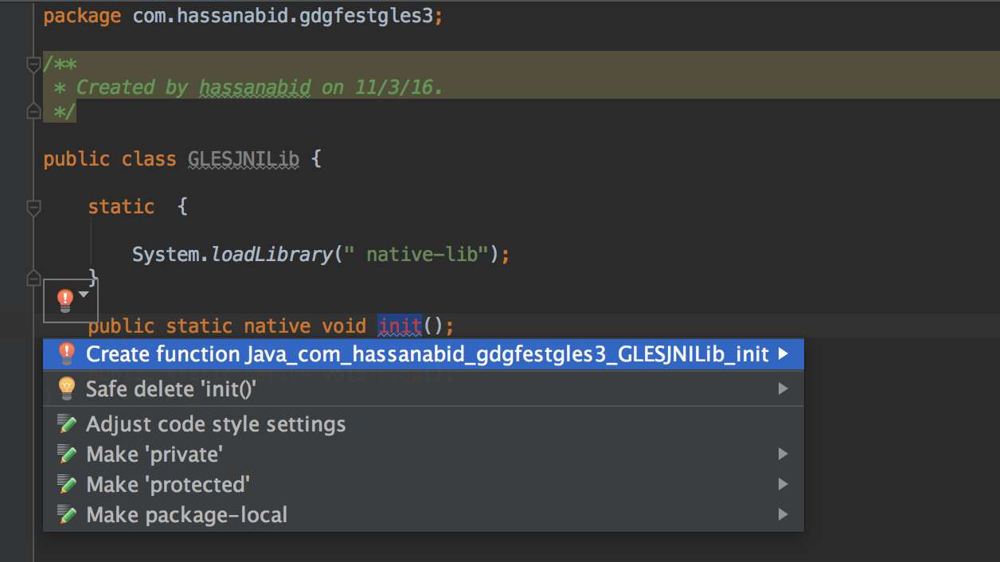

# Add Native Code

We are going to add native code in cpp folder. 

1. Right click on `cpp` folder New -> C++ class. Give it a name `glesjni`. and press OK. You will see two files created on your computer `glesjni.h` and `glesjni.cpp`. 

Add following content to `glesjni.h` in between the tags as below

```c++ 
#ifndef GDGFESTGLES3_GLESJNI_H
#define GDGFESTGLES3_GLESJNI_H 1

// PASTE BELOW Code here HERE 


#endif //GDGFESTGLES3_GLESJNI_H

```

```c++

#include <android/log.h>
#include <math.h>


#include <GLES3/gl3.h>

#define DEBUG 1

#define LOG_TAG "GLESJNI"
#define ALOGE(...) __android_log_print(ANDROID_LOG_ERROR, LOG_TAG, __VA_ARGS__)
#if DEBUG
#define ALOGV(...) __android_log_print(ANDROID_LOG_VERBOSE, LOG_TAG, __VA_ARGS__)
#else
#define ALOGV(...)
#endif

// ----------------------------------------------------------------------------
// Types, functions, and data used by both ES2 and ES3 renderers.
// Defined in gles3jni.cpp.

#define MAX_INSTANCES_PER_SIDE 16
#define MAX_INSTANCES   (MAX_INSTANCES_PER_SIDE * MAX_INSTANCES_PER_SIDE)
#define TWO_PI          (2.0 * M_PI)
#define MAX_ROT_SPEED   (0.3 * TWO_PI)

// This demo uses three coordinate spaces:
// - The model (a quad) is in a [-1 .. 1]^2 space
// - Scene space is either
//    landscape: [-1 .. 1] x [-1/(2*w/h) .. 1/(2*w/h)]
//    portrait:  [-1/(2*h/w) .. 1/(2*h/w)] x [-1 .. 1]
// - Clip space in OpenGL is [-1 .. 1]^2
//
// Conceptually, the quads are rotated in model space, then scaled (uniformly)
// and translated to place them in scene space. Scene space is then
// non-uniformly scaled to clip space. In practice the transforms are combined
// so vertices go directly from model to clip space.

struct Vertex {
    GLfloat pos[2];
    GLubyte rgba[4];
};
extern const Vertex QUAD[4];

// returns true if a GL error occurred
extern bool checkGlError(const char* funcName);
extern GLuint createShader(GLenum shaderType, const char* src);
extern GLuint createProgram(const char* vtxSrc, const char* fragSrc);

// ----------------------------------------------------------------------------
// Interface to the ES2 and ES3 renderers, used by JNI code.

class Renderer {
public:
    virtual ~Renderer();
    void resize(int w, int h);
    void render();

protected:
    Renderer();

    // return a pointer to a buffer of MAX_INSTANCES * sizeof(vec2).
    // the buffer is filled with per-instance offsets, then unmapped.
    virtual float* mapOffsetBuf() = 0;
    virtual void unmapOffsetBuf() = 0;
    // return a pointer to a buffer of MAX_INSTANCES * sizeof(vec4).
    // the buffer is filled with per-instance scale and rotation transforms.
    virtual float* mapTransformBuf() = 0;
    virtual void unmapTransformBuf() = 0;

    virtual void draw(unsigned int numInstances) = 0;

private:
    void calcSceneParams(unsigned int w, unsigned int h, float* offsets);
    void step();

    unsigned int mNumInstances;
    float mScale[2];
    float mAngularVelocity[MAX_INSTANCES];
    uint64_t mLastFrameNs;
    float mAngles[MAX_INSTANCES];
};

extern Renderer* createES2Renderer();

```

Copy the following code in `glesjni.cpp`

```c++ 

/*
 * Copyright 2013 The Android Open Source Project
 *
 * Licensed under the Apache License, Version 2.0 (the "License");
 * you may not use this file except in compliance with the License.
 * You may obtain a copy of the License at
 *
 *      http://www.apache.org/licenses/LICENSE-2.0
 *
 * Unless required by applicable law or agreed to in writing, software
 * distributed under the License is distributed on an "AS IS" BASIS,
 * WITHOUT WARRANTIES OR CONDITIONS OF ANY KIND, either express or implied.
 * See the License for the specific language governing permissions and
 * limitations under the License.
 */

#include <jni.h>
#include <stdlib.h>
#include <time.h>

#include "glesjni.h"

const Vertex QUAD[4] = {
        // Square with diagonal < 2 so that it fits in a [-1 .. 1]^2 square
        // regardless of rotation.
        {{-0.7f, -0.7f}, {0x00, 0xFF, 0x00}},
        {{ 0.7f, -0.7f}, {0x00, 0x00, 0xFF}},
        {{-0.7f,  0.7f}, {0xFF, 0x00, 0x00}},
        {{ 0.7f,  0.7f}, {0xFF, 0xFF, 0xFF}},
};

bool checkGlError(const char* funcName) {
    GLint err = glGetError();
    if (err != GL_NO_ERROR) {
        ALOGE("GL error after %s(): 0x%08x\n", funcName, err);
        return true;
    }
    return false;
}

GLuint createShader(GLenum shaderType, const char* src) {
    GLuint shader = glCreateShader(shaderType);
    if (!shader) {
        checkGlError("glCreateShader");
        return 0;
    }
    glShaderSource(shader, 1, &src, NULL);

    GLint compiled = GL_FALSE;
    glCompileShader(shader);
    glGetShaderiv(shader, GL_COMPILE_STATUS, &compiled);
    if (!compiled) {
        GLint infoLogLen = 0;
        glGetShaderiv(shader, GL_INFO_LOG_LENGTH, &infoLogLen);
        if (infoLogLen > 0) {
            GLchar* infoLog = (GLchar*)malloc(infoLogLen);
            if (infoLog) {
                glGetShaderInfoLog(shader, infoLogLen, NULL, infoLog);
                ALOGE("Could not compile %s shader:\n%s\n",
                      shaderType == GL_VERTEX_SHADER ? "vertex" : "fragment",
                      infoLog);
                free(infoLog);
            }
        }
        glDeleteShader(shader);
        return 0;
    }

    return shader;
}

GLuint createProgram(const char* vtxSrc, const char* fragSrc) {
    GLuint vtxShader = 0;
    GLuint fragShader = 0;
    GLuint program = 0;
    GLint linked = GL_FALSE;

    vtxShader = createShader(GL_VERTEX_SHADER, vtxSrc);
    if (!vtxShader)
        goto exit;

    fragShader = createShader(GL_FRAGMENT_SHADER, fragSrc);
    if (!fragShader)
        goto exit;

    program = glCreateProgram();
    if (!program) {
        checkGlError("glCreateProgram");
        goto exit;
    }
    glAttachShader(program, vtxShader);
    glAttachShader(program, fragShader);

    glLinkProgram(program);
    glGetProgramiv(program, GL_LINK_STATUS, &linked);
    if (!linked) {
        ALOGE("Could not link program");
        GLint infoLogLen = 0;
        glGetProgramiv(program, GL_INFO_LOG_LENGTH, &infoLogLen);
        if (infoLogLen) {
            GLchar* infoLog = (GLchar*)malloc(infoLogLen);
            if (infoLog) {
                glGetProgramInfoLog(program, infoLogLen, NULL, infoLog);
                ALOGE("Could not link program:\n%s\n", infoLog);
                free(infoLog);
            }
        }
        glDeleteProgram(program);
        program = 0;
    }

    exit:
    glDeleteShader(vtxShader);
    glDeleteShader(fragShader);
    return program;
}

static void printGlString(const char* name, GLenum s) {
    const char* v = (const char*)glGetString(s);
    ALOGV("GL %s: %s\n", name, v);
}

// ----------------------------------------------------------------------------

Renderer::Renderer()
        :   mNumInstances(0),
            mLastFrameNs(0)
{
    memset(mScale, 0, sizeof(mScale));
    memset(mAngularVelocity, 0, sizeof(mAngularVelocity));
    memset(mAngles, 0, sizeof(mAngles));
}

Renderer::~Renderer() {
}

void Renderer::resize(int w, int h) {
    auto offsets = mapOffsetBuf();
    calcSceneParams(w, h, offsets);
    unmapOffsetBuf();

    // Auto gives a signed int :-(
    for (auto i = (unsigned)0; i < mNumInstances; i++) {
        mAngles[i] = drand48() * TWO_PI;
        mAngularVelocity[i] = MAX_ROT_SPEED * (2.0*drand48() - 1.0);
    }

    mLastFrameNs = 0;

    glViewport(0, 0, w, h);
}

void Renderer::calcSceneParams(unsigned int w, unsigned int h,
                               float* offsets) {
    // number of cells along the larger screen dimension
    const float NCELLS_MAJOR = MAX_INSTANCES_PER_SIDE;
    // cell size in scene space
    const float CELL_SIZE = 2.0f / NCELLS_MAJOR;

    // Calculations are done in "landscape", i.e. assuming dim[0] >= dim[1].
    // Only at the end are values put in the opposite order if h > w.
    const float dim[2] = {fmaxf(w,h), fminf(w,h)};
    const float aspect[2] = {dim[0] / dim[1], dim[1] / dim[0]};
    const float scene2clip[2] = {1.0f, aspect[0]};
    const int ncells[2] = {
            static_cast<int>(NCELLS_MAJOR),
            (int)floorf(NCELLS_MAJOR * aspect[1])
    };

    float centers[2][MAX_INSTANCES_PER_SIDE];
    for (int d = 0; d < 2; d++) {
        auto offset = -ncells[d] / NCELLS_MAJOR; // -1.0 for d=0
        for (auto i = 0; i < ncells[d]; i++) {
            centers[d][i] = scene2clip[d] * (CELL_SIZE*(i + 0.5f) + offset);
        }
    }

    int major = w >= h ? 0 : 1;
    int minor = w >= h ? 1 : 0;
    // outer product of centers[0] and centers[1]
    for (int i = 0; i < ncells[0]; i++) {
        for (int j = 0; j < ncells[1]; j++) {
            int idx = i*ncells[1] + j;
            offsets[2*idx + major] = centers[0][i];
            offsets[2*idx + minor] = centers[1][j];
        }
    }

    mNumInstances = ncells[0] * ncells[1];
    mScale[major] = 0.5f * CELL_SIZE * scene2clip[0];
    mScale[minor] = 0.5f * CELL_SIZE * scene2clip[1];
}

void Renderer::step() {
    timespec now;
    clock_gettime(CLOCK_MONOTONIC, &now);
    auto nowNs = now.tv_sec*1000000000ull + now.tv_nsec;

    if (mLastFrameNs > 0) {
        float dt = float(nowNs - mLastFrameNs) * 0.000000001f;

        for (unsigned int i = 0; i < mNumInstances; i++) {
            mAngles[i] += mAngularVelocity[i] * dt;
            if (mAngles[i] >= TWO_PI) {
                mAngles[i] -= TWO_PI;
            } else if (mAngles[i] <= -TWO_PI) {
                mAngles[i] += TWO_PI;
            }
        }

        float* transforms = mapTransformBuf();
        for (unsigned int i = 0; i < mNumInstances; i++) {
            float s = sinf(mAngles[i]);
            float c = cosf(mAngles[i]);
            transforms[4*i + 0] =  c * mScale[0];
            transforms[4*i + 1] =  s * mScale[1];
            transforms[4*i + 2] = -s * mScale[0];
            transforms[4*i + 3] =  c * mScale[1];
        }
        unmapTransformBuf();
    }

    mLastFrameNs = nowNs;
}

void Renderer::render() {
    step();

    glClearColor(0.2f, 0.2f, 0.3f, 1.0f);
    glClear(GL_COLOR_BUFFER_BIT | GL_DEPTH_BUFFER_BIT);
    draw(mNumInstances);
    checkGlError("Renderer::render");
}

// ----------------------------------------------------------------------------

static Renderer* g_renderer = NULL;

```

At this point, if you won't see `glesjni.h` and `glesjni.cpp` file in cpp folder. It is because we haven't added it in our CMake script. Let's do it now. Add following line in CMakeLists.txt file below `src/main/cpp/native-lib.cpp`.

``` 
src/main/cpp/glesjni.cpp 
```

so that your `add_library` looks like following

```bash

add_library( # Sets the name of the library.
             native-lib

             # Sets the library as a shared library.
             SHARED

             # Provides a relative path to your source file(s).
             # Associated headers in the same location as their source
             # file are automatically included.
             src/main/cpp/native-lib.cpp
             src/main/cpp/glesjni.cpp)
```


2. Next, we are going to add JNI methods. Android studio provides a convenient way to add it automatically form Java code.

Create a new file `GLESJNILib` in same directory as `gdgfestgles3` and add following code.

```java

public class GLESJNILib {

    static  {

        System.loadLibrary(" native-lib");
    }

    public static native void init();
    public static native void resize(int width, int height);
    public static native void step();
}

```

Wait for context aware menu prompt to appear. Click on  to open popupmenu. 

Select `Create Function Java_..._init()` function. 
Android Studio creates a prototype function for init() in `glesjni.cpp` file under the "cpp" folder. 



Repeat the above process for `resize` and `step` function.

After we are done, we will see the following three functions in `glesjni.cpp`

```c++

JNIEXPORT void JNICALL
Java_com_hassanabid_gdgfestgles3_GLESJNILib_init(JNIEnv *env, jclass type) {

    // TODO

}

JNIEXPORT void JNICALL
Java_com_hassanabid_gdgfestgles3_GLESJNILib_resize(JNIEnv *env, jclass type, jint width,
                                                   jint height) {

    // TODO

}

JNIEXPORT void JNICALL
Java_com_hassanabid_gdgfestgles3_GLESJNILib_step(JNIEnv *env, jclass type) {

    // TODO

}

```

3. We have to declare above three JNI methods with extern "C" keyword so that can be used elsewhere if we provide `libnative-lib.so` file.

Add following code above JNI methods in `glesjni.cpp`

```c++

extern "C" {
JNIEXPORT void JNICALL Java_com_hassanabid_gdgfestgles3_GLESJNILib_init(JNIEnv* env, jclass type);
JNIEXPORT void JNICALL Java_com_hassanabid_gdgfestgles3_GLESJNILib_resize(JNIEnv* env, jclass type, jint width, jint height);
JNIEXPORT void JNICALL Java_com_hassanabid_gdgfestgles3_GLESJNILib_step(JNIEnv* env, jclass type);
};


```

Sync , Build , there should be some `errors` from Android Studio. Let's fix them in [next](add_native_code_part_2.md) chapter.

