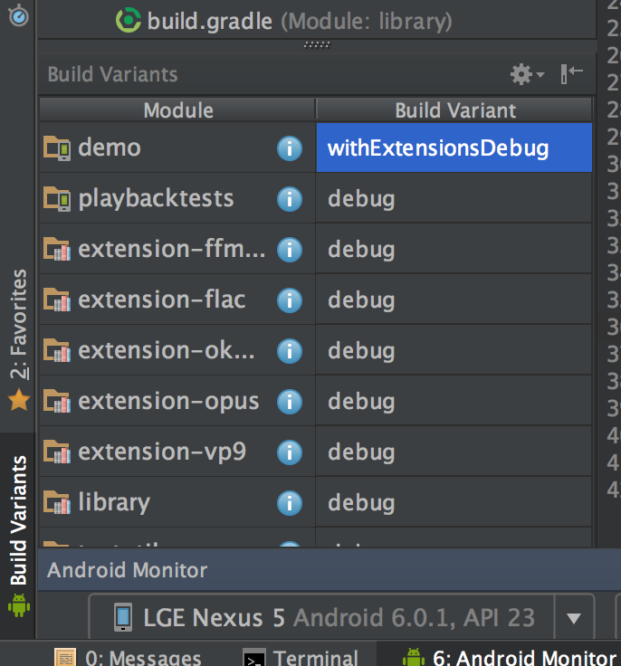

# Build VP9 Extension Codec

ExoPlayer 2 hides lots of complexity of the code in the class SimpleExoPlayer. This comes with a disadvantage of writing your own custom Renderer. For this tutorial, we are going to use main ExoPlayer repo and build VP9 codec.

###Checkout 

Checkout ExoPlayer with extension

```bash
git clone https://github.com/google/ExoPlayer.git
```


### Build

Set the following environment variables:

```bash
cd "<path to exoplayer checkout>"
EXOPLAYER_ROOT="$(pwd)"
VP9_EXT_PATH="${EXOPLAYER_ROOT}/extensions/vp9/src/main"

```

Android NDK

```bash
NDK_PATH="<path to Android NDK>"
```

##### Fetch libvpx and libyuv:
```bash

cd "${VP9_EXT_PATH}/jni" && \
git clone https://chromium.googlesource.com/webm/libvpx libvpx && \
git clone https://chromium.googlesource.com/libyuv/libyuv libyuv
```

Run a script that generates necessary configuration files for libvpx:

```bash
./generate_libvpx_android_configs.sh "${NDK_PATH}"
```


> If there is build problem, use contents of this [gist](https://gist.github.com/hassanabidpk/a7f741cbf43e53f2508dfdd10c290215) and replace 
generate_libvpx_android_configs.sh.

Build JNI native libraries 

```bash
${NDK_PATH}/ndk-build APP_ABI=armeabi-v7a -j4
```


You will see a new folder called `libs` appeared with `.so` files.

Build project with Build Variant `withExtensionDebug` as shown in the picture below.




Run the project.  You can verify that `.so` native libraries are added in ExoPlayer apk by `analyzing APK`.


### Test

Play a content in `MISC -> VP9`.  In the logs you should see 

```bash
Loaded LibvpxVideoRenderer.
```
Which confirms that VP9 codec is used!

