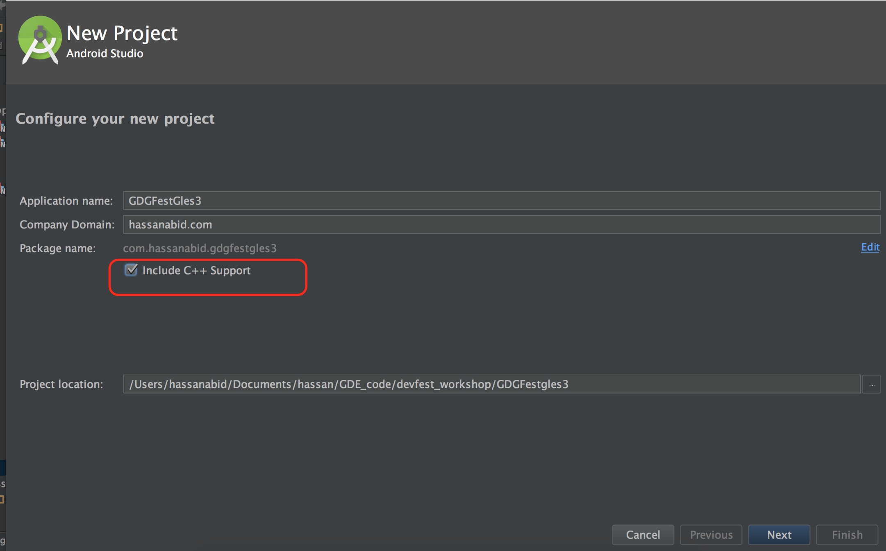
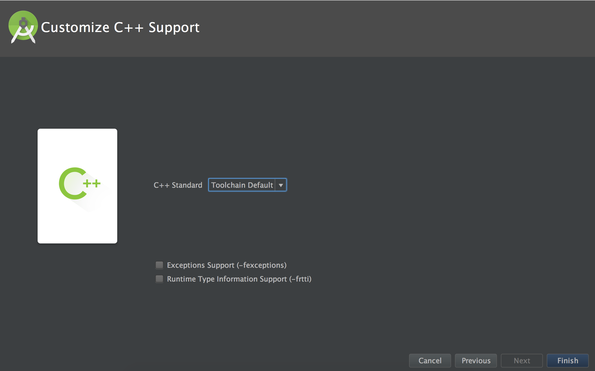
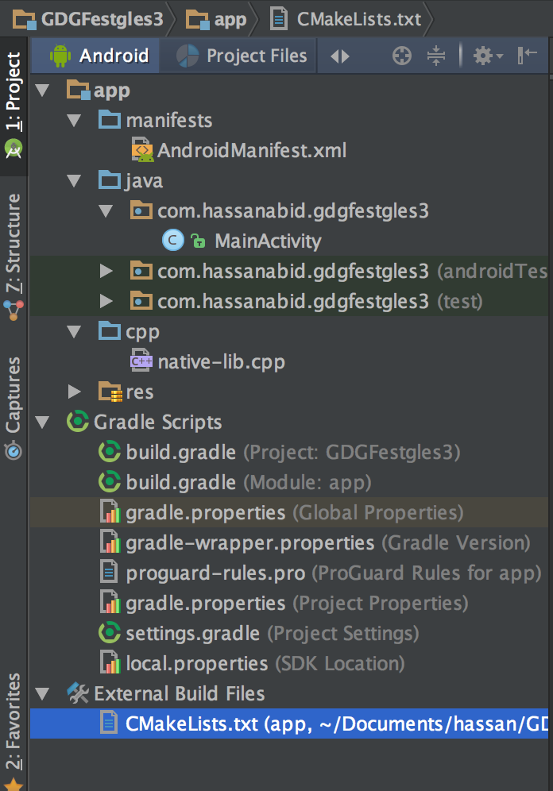
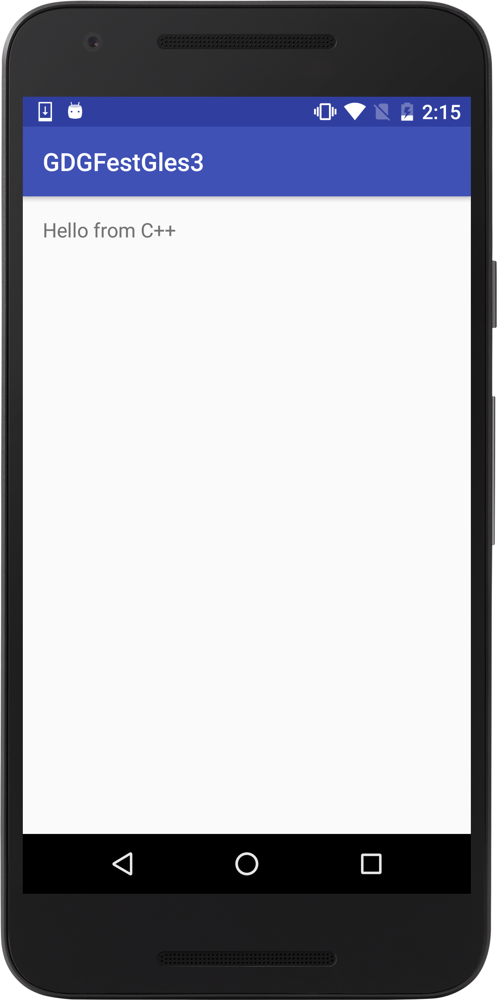

# Create new Project with C/C++ support

1- Click on File -> New Project 




``` Don't forget to add Include C++ support ```

2-  In the next screen, select Empty activity. In the custom C++ window, use the defaul values.



3- Click finish! 

You should see following directory structure.




4.  Click Run, you will see the following on your target device or Emulator:




