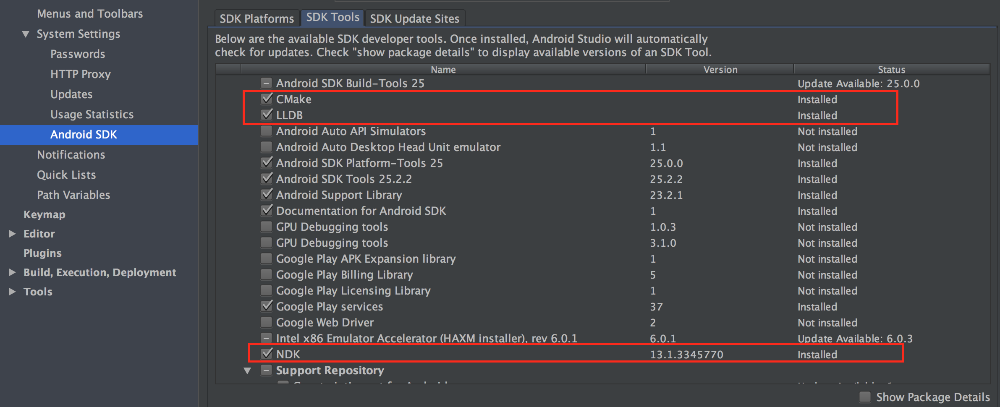

# Download and Install

* [The Android Native Development Kit (NDK)](https://developer.android.com/ndk/index.html)
* [CMake](https://cmake.org/)
* [LLDB](http://lldb.llvm.org/) (the debugger Android Studio uses to debug native code)

You can download them using Android Studio

Open SDK manager in Android studio and select SDK Tools.

Click apply and OK to finish installation. 

