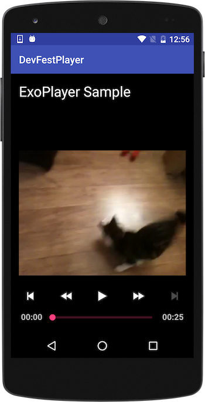

# ExoPlayer Integration

This tutorial will let you understand basic ExoPlayer integration and also you learn about adding one codec extension `vp9` to it. 

I have created a git repository for the startup code.

###Getting the code

The source code for the sample app can be found on GitHub project. If you haven’t already done so, clone the project into a local directory:

```bash
$ git clone https://github.com/hassanabidpk/DevFestPlayer.git
```

Build and Run the app, you will see following screen. You can play the MP4 content.




Move to next chapter for building VP9 Codec and integrating it with ExoPlayer.


